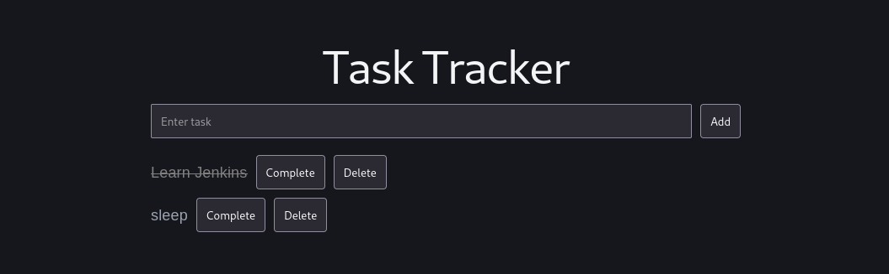
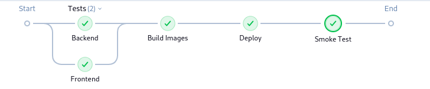

# Task Tracker

A simple full-stack Task Tracker application used to demonstrate a complete CI/CD workflow using Jenkins, Docker, Docker Compose, and containerized build agents.



This project showcases:

- Jenkins Declarative Pipelines
- Parallel execution of frontend and backend test stages
- Docker-based Jenkins build agents
- Docker image creation and deployment
- Docker Compose orchestration
- Automated smoke testing after deployment


### Architecture


### Prerequisites

This guide assumes:

- AWS EC2 instance (t2.small or higher)
- Ubuntu 24.04 LTS
- 10 GiB or more disk space
- Security Groups allowing:
  - TCP 22 (SSH)
  - TCP 8080 (Jenkins)
  - TCP 80 (Application)


## Jenkins Installation

Reference: https://www.jenkins.io/doc/book/installing/linux/

### Install Java

```bash
sudo apt update
sudo apt install -y fontconfig openjdk-21-jre

java -version
```

### Add Jenkins Repository

```bash
sudo wget -O /etc/apt/keyrings/jenkins-keyring.asc \
https://pkg.jenkins.io/debian-stable/jenkins.io-2026.key

echo "deb [signed-by=/etc/apt/keyrings/jenkins-keyring.asc]" \
https://pkg.jenkins.io/debian-stable binary/ | sudo tee \
/etc/apt/sources.list.d/jenkins.list > /dev/null
```

### Install Jenkins

```bash
sudo apt update
sudo apt install -y jenkins
```

### Obtain Initial Admin Password

```bash
sudo cat /var/lib/jenkins/secrets/initialAdminPassword
```

Open Jenkins:

```text
http://<EC2-PUBLIC-IP>:8080
```

Install the suggested plugins when prompted.


## Docker Installation

Install Docker Engine and Docker Compose Plugin.

```bash
sudo apt update

sudo apt install -y docker.io
sudo apt install -y docker-compose-v2
```

Verify installation:

```bash
docker --version
docker compose version
```


## Configure Docker Permissions

Allow Jenkins and Ubuntu users to access the Docker daemon.

```bash
sudo usermod -aG docker jenkins
sudo usermod -aG docker ubuntu
```

Restart Docker:

```bash
sudo systemctl restart docker
```

Restart Jenkins:

```bash
sudo systemctl restart jenkins
```

Alternatively:

```text
http://<EC2-PUBLIC-IP>:8080/restart
```


## Jenkins Plugin Installation

Make sure to click on Install suggested plugins to install the necessary plugins to make to setup process simpler and just install the **Docker** and **Docker Pipeline** plugin.


To handle installation of only the requiered pugin, follow the steps below.
Navigate to:

```text
Manage Jenkins
    └── Manage Plugins
```

Install:

- Docker
- Docker Pipeline
- Pipeline
- Git
- GitHub Integration

Restart Jenkins after installation.


## Create Jenkins Pipeline

Create a new Pipeline Job and configure:

### Pipeline Definition

```text
Pipeline Script from SCM
```

### SCM

```text
Git
```

### Repository URL

```text
https://github.com/<your-username>/task-tracker.git
```

### Script Path

```text
Jenkinsfile
```

Save and build the pipeline.


## Pipeline Stages

The pipeline performs:

### 1. Backend Testing

Runs inside a Python Docker container.

```bash
pip install -r requirements.txt
pytest
```

### 2. Frontend Testing

Runs inside a Node.js Docker container.

```bash
npm ci
npm test
```

### 3. Build Docker Images

```bash
docker compose build
```

### 4. Deploy Application

```bash
docker compose up -d
```

### 5. Smoke Testing

Validates that deployed services are accessible.


## Running the Application

After successful deployment:

```text
http://<EC2-PUBLIC-IP>
```

Backend API:

```text
http://<EC2-PUBLIC-IP>:5000
```
